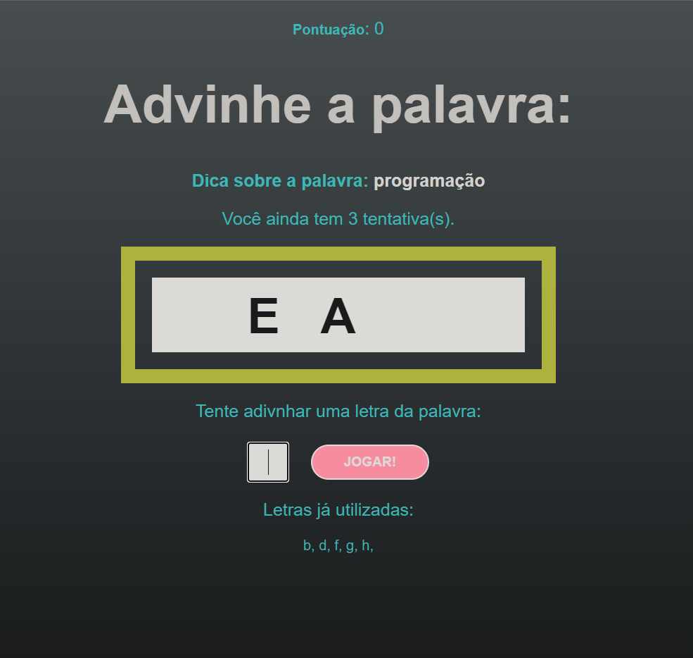

Projeto, adivinhador de palavras, desenvolvido para testar as habilidades com React.
O Projeto carrega uma API fixa, com os dados que são consumidos no front pelo React. 

Disponivel em: https://vercel.com/hugorambo/secret-word

